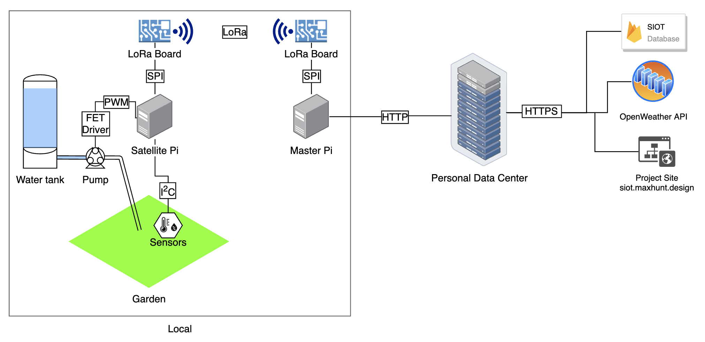
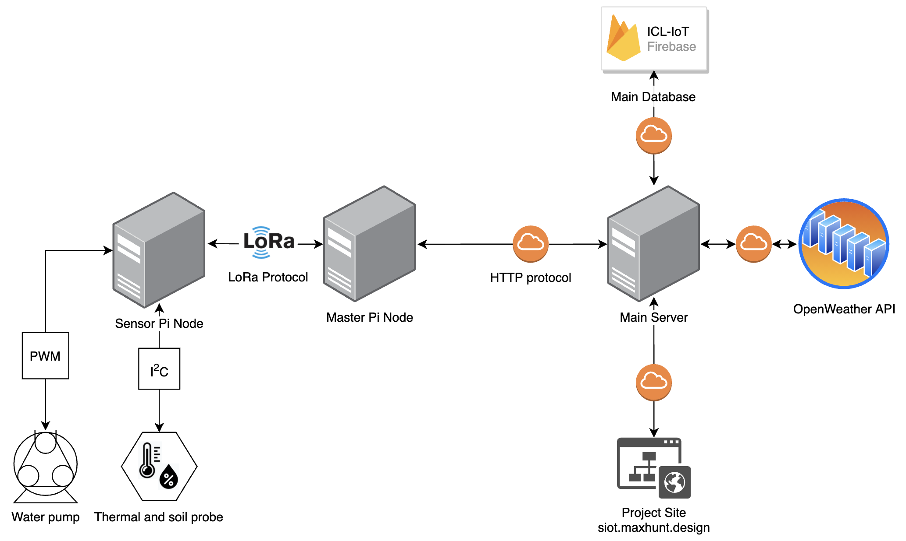
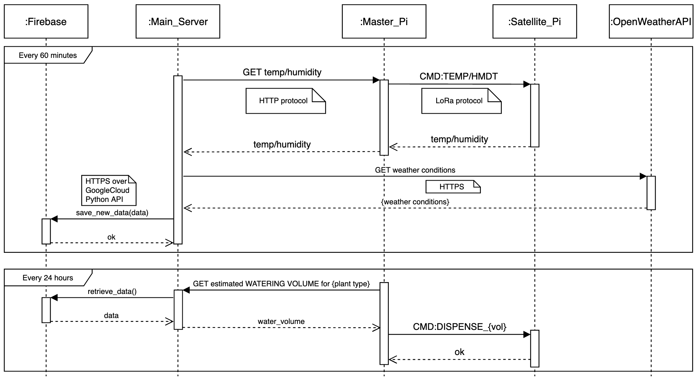
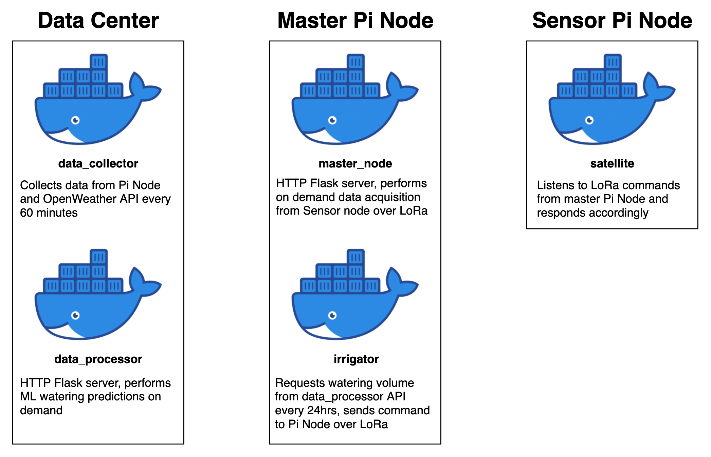
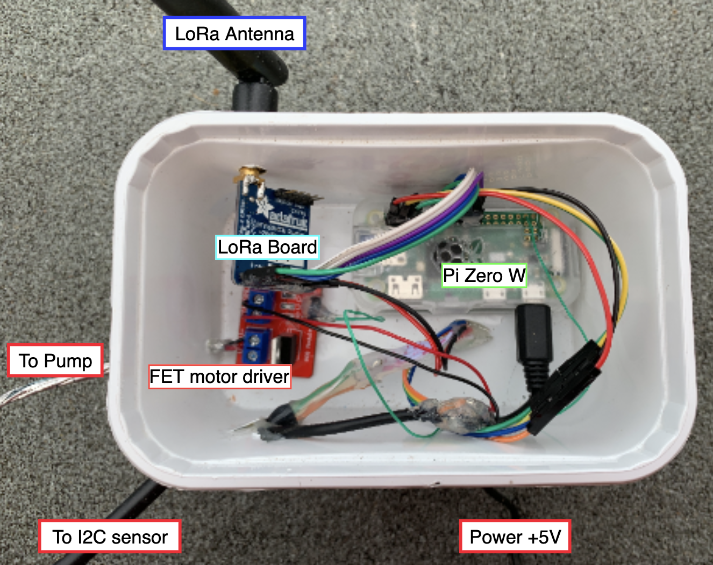

# Imperial College London
# Sensing and IoT Coursework Project
#### Reducing water waste by automatically dispensing lower bound water amounts, calculated using a ML Model using present weather data

## About
This project aims to integrate hardware IoT sensors (some RPi Zero's with I2C probes) and a Deep Neural Network to predict how much water an outdoor garden will need every day.

The ML Model uses the last 24hrs of collected weather data to make a prediction around mow much water needs to be dispensed to keep the plants alive.

This approach hopes to reduce the overall water use by preventing excessive watering.

## Project diagram

## File Structure

This part is long, click to expand

- `data_collector/` Main data collector and uploader module
  - `secrets/` Private API keys
    - `icl-iot-weather-firebase-adminsdk.json` Firebase key for database access
    - `weather_api_key.txt` OpenWeather API key
  - `data_collector.py` Python script for data collection
  - `Dockerfile` Containerizing the application
  - `requirements.txt` Python requirements for running the script
- `data_processor/` ML on demand data processing module
  - `firebase_python_image/` Since building a tf image takes ages, we build it once and use it for testing the ml script later
    - `Dockerfile` Building a tensorflow image for armv7l
  - `secrets/` Private API keys
    - `icl-iot-weather-firebase-adminsdk.json` Firebase key for database access
  - `watering_model.model/` Saved ML model for water predictions
  - `Dockerfile` Containerizing the application
  - `water_predictor.py` On demand, real time watering predictor script
- `Diagrams/` Process and block diagrams
  - `source/*` Editable `.drawio` diagrams
  - `Docker_process_diagram.png` Diagram of all processes running on all devices
  - `Hardware_block_diagram.png` Block diagram of the project hardware
  - `Main_project_diagram.png` Overall project system diagram
  - `UML_process_diagram.png` UML diagram detailing software processes
- `lora_nodes/` Scripts running on the Pi Zero nodes
  - `master/` Scripts running on the primary, internet connected Pi
    - `irrigator/` Daily watering module
      - `Dockerfile` Containerizing the application
      - `irrigator.py` Daily watering script
      - `requirements.txt` Python requirements for running the script
    - `Dockerfile` Containerizing the application
    - `main.py` Main data server, collects data from satellite over LoRa and returns over http
    - `requirements.txt` Python requirements for running the script
  - `satellite/` Data reading and sending module for the sensor Pi
    - `Dockerfile` Containerizing the application
    - `main.py` LoRa commend listener, temperature reader and pump controller
    - `requirements.txt` Python requirements for running the script
- `manual_data_processing/` iPython notebooks used for data processing and model training
  - `datasets/*` Various datasets used for processing and training
  - `On_Demand_water_predictor.ipynb` Interactive notebook used in creating the on demand water predictor script
  - `SIOT_ML_MODEL.ipynb` Interactive notebook used for model creation
  - `Dataset exporter.ipynb` Interactive notebook for exporting all data to csv
  - `Firestore Dataset injector.ipynb` Interactive notebook for injecting new data into database (useful if something was missed during logging)
- `site/*` Monitoring website, HTML+CSS+JS, hosted on Firebase
- `.gitignore` Gitignore file preventing all my API keys from showing up online...
- `README.md` See [README.md](README.md)

## Installation and running
1. Clone this repo
2. Create the secrets folders
3. Generate a set of firebase and OpenWeather API credentials and place them in the secrets folders, rename accordingly
4. Move the `master` folder to the main Pi
5. Move the `satellite` folder to the sensor Pi
6. Install Docker on all Devices
7. Build the docker images on the relevant architectures (for me everything was build on armv7)
   - `data_collector`: `docker build -t siot-weather-collector .`
   - `data_processor`: `docker build -t siot-data-processor .`
   - `master`: `docker build -t master-node .`
   - `master/irrigator`: `docker build -t irrigator .`
   - `satellite`: `docker build -t satellite .`
8. *NOTE: The ML Dockerfile is very long and complicated because tensorflow does not play well with a 32 bit arm architecture, if you are building for x86 or arm64, you may need to change the file*
9.  Run the docker containers:
   - The `data_collector` on the cloud device: `docker run -d --restart=always --name siot_weather_collector siot-weather-collector`
   - The `data_processor` on the cloud device: `docker run -dp 3535:3535 --restart=always --name siot_watering_predictor  siot-data-processor`
   - The `master` on the master Pi: `docker run -dp 3333:3333 --privileged --restart=always master-node`
   - The `master/irrigator` on the master Pi: `docker run -d --privileged --restart=always irrigator`
   - The `satellite` on the sensor Pi: `docker run -d --privileged --restart=always satellite`
10. While you are free to use my ML model included in this repo, I suggest you explore the `manual_data_processing` folder and create your own.
11. You will also need at least 24hrs of data before the model can make predictions, so the `siot-weather-collector` image must be started at least 24hrs before the others

## Maintainers and Contributors

   Max Hunt: [me@maxhunt.design](mailto:me@maxhunt.design)   

## External resources
[Docker](https://docs.docker.com)  
[Nginx](https://nginx.org/en/docs/) 
[ddclient](https://sourceforge.net/p/ddclient/wiki/Home/) 
[Node](https://nodejs.org/en/docs/)  
[Plotly.js](https://plotly.com/javascript/reference/) 
[Express](https://expressjs.com/en/5x/api.html) 
[Raspberry Pi OS](https://www.raspberrypi.org/software/)

Python:
- [Requests](https://requests.readthedocs.io/en/master/api/)
- [Flask](https://flask.palletsprojects.com/en/1.1.x/api/)
- [CircuitPython](https://circuitpython.readthedocs.io/en/6.0.x/README.html)
- [RMF69](https://circuitpython.readthedocs.io/projects/rfm69/en/latest/api.html)
- [MCP9808](https://circuitpython.readthedocs.io/projects/mcp9808/en/latest/)
- [Firebase](https://firebase.google.com/docs/reference/admin/python)
- [TensorFlow](https://www.tensorflow.org/api_docs)
- [Keras](https://keras.io/api/)

## Appendix

Hardware block diagram:

UML Diagram:

Docker process diagram:

Satellite node:

